**Note:** For the screenshots, you can store all of your answer images in the `answer-img` directory.

## Verify the monitoring installation

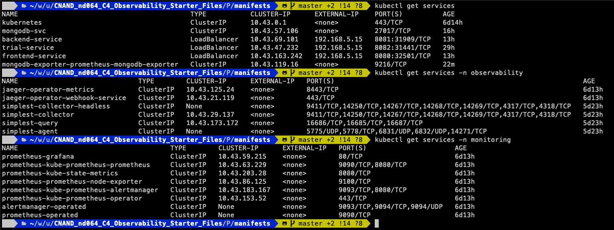
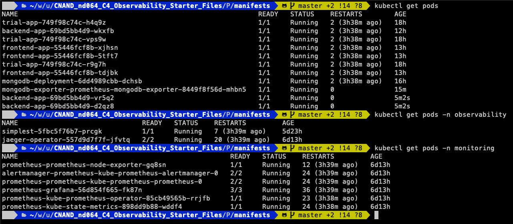

## Setup the Jaeger and Prometheus source
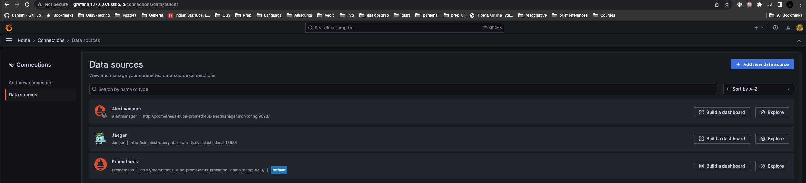

## Create a Basic Dashboard
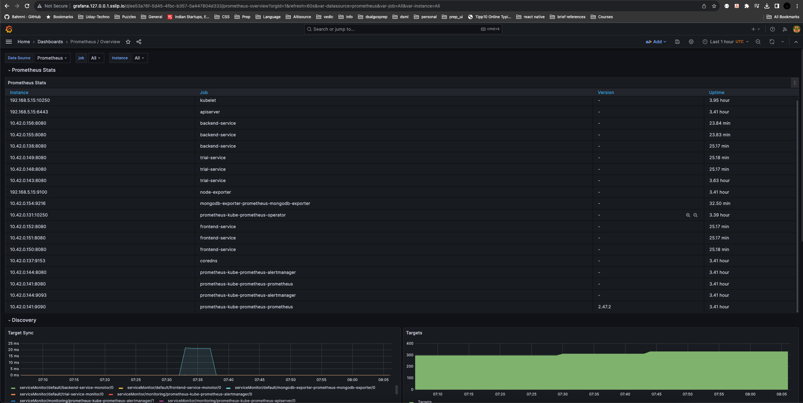
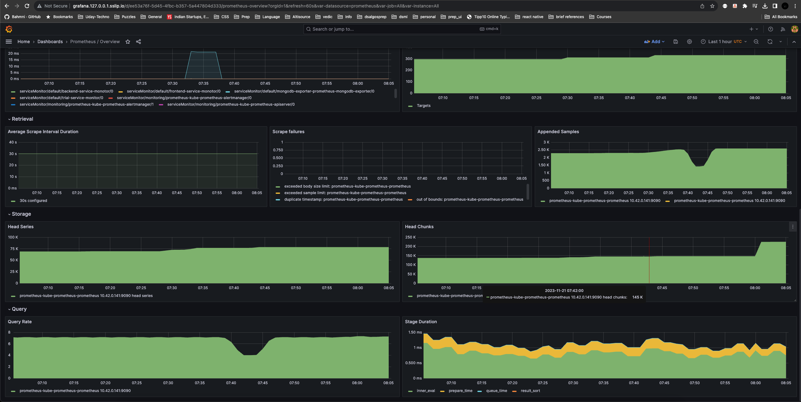

## Describe SLO/SLI
Below are the SLOs for a monthly uptime and request response time:
1. 99.5% uptime in a month
2. 99% of the requests are served under 200 milliseconds

Below are the actual metrics for the current year (SLI): 
1. We had 99.8% uptime current year
2. 99% of the API calls had request response time of 150 milliseconds

## Creating SLI metrics.
1. Latency: Request response time 
2. 40X & 50X Errors: Number of requests that have errors/failed
3. CPU & Memory Usage: Average CPU and Memory, this indicates the overall capacity at which the service is running.
4. Uptime: Percentage of the time service is hosted/running
5. Traffic: Number of incoming requests to the service 

## Create a Dashboard to measure our SLIs
Pods uptime in Prometheus
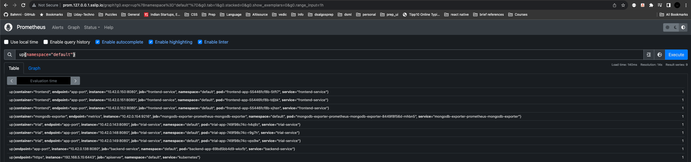

Services uptime in Grafana

## Tracing our Flask App
Traces
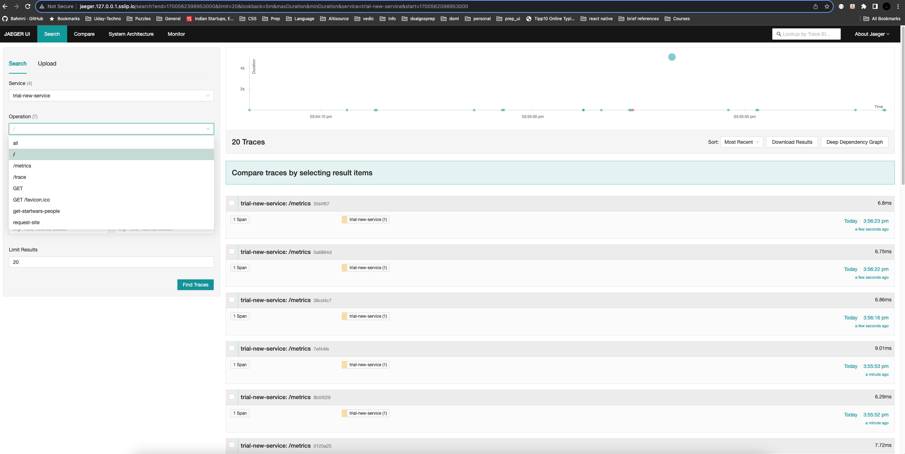
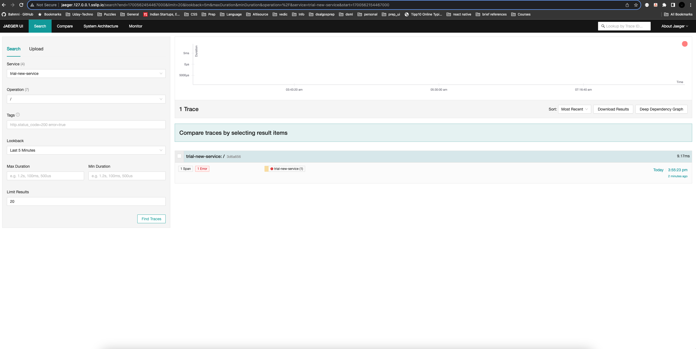
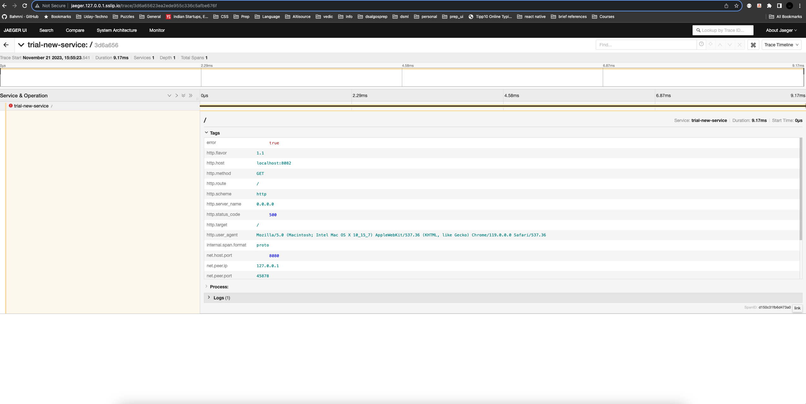
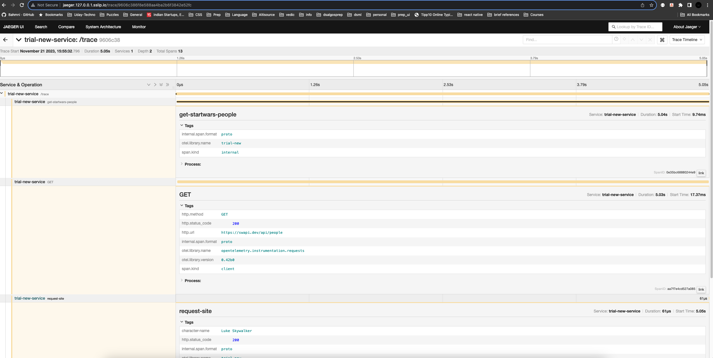

Code
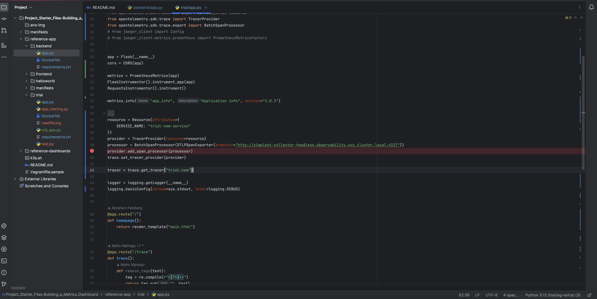
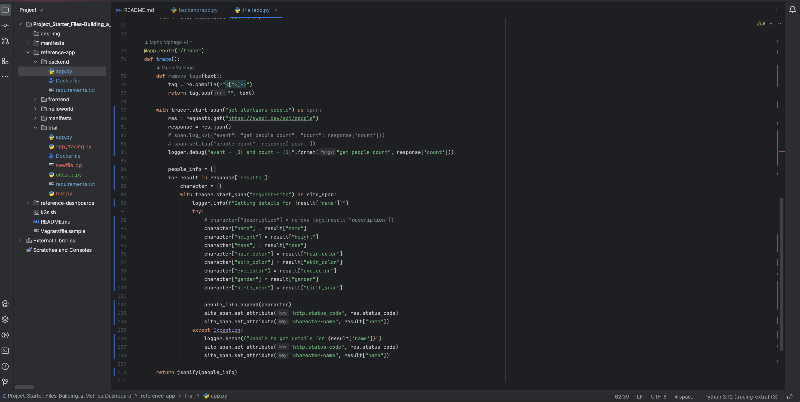

## Jaeger in Dashboards
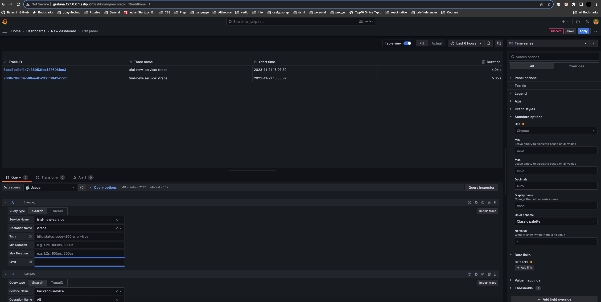

## Report Error
TROUBLE TICKET

Name: Venkat Repaka

Date: 22-Nov-2023

Subject: Service - trial, Endpoint - /trace failed with 500 errors 

Affected Area: Trial service trace

Severity: High

Description: endpoint /trace in trial service is failing with 500 error. 

## Creating SLIs and SLOs
1. Service uptime of 99.8%
2. Average latency under 200 milliseconds
3. Error rate (40X or 50X) to be under 0.1% or success rate (20X) above 99.5%

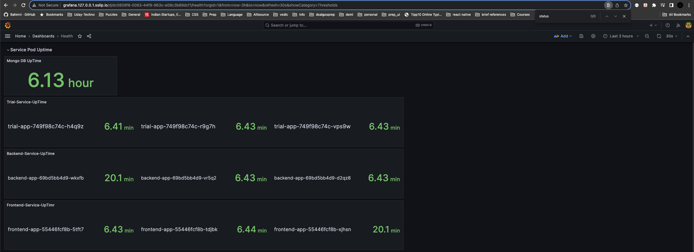
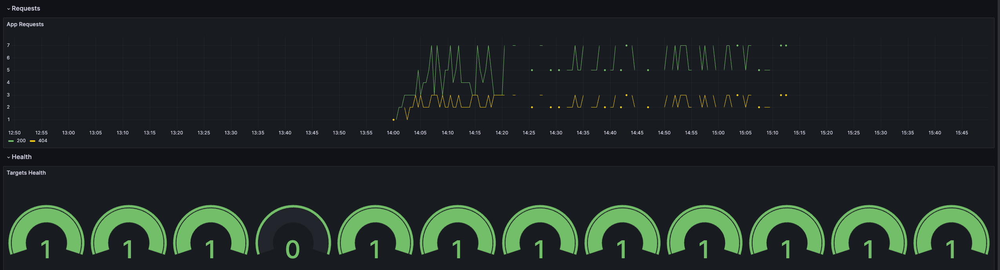

## Building KPIs for our plan
1. Latency - 90 percentile of request durations are under 200ms and average response time is under 200ms
2. Uptime - Service uptime of at least 99.9%
3. Errors - Number of failed responses is below 0.5%

## Final Dashboard 
Final Dahsboard
